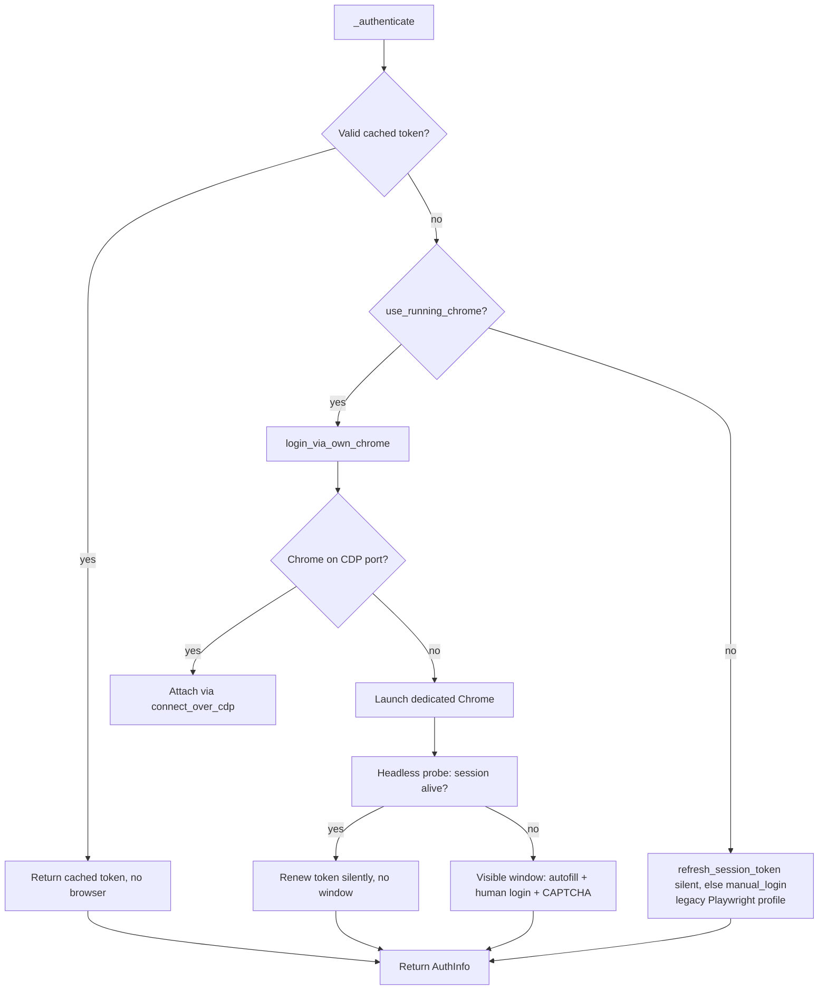
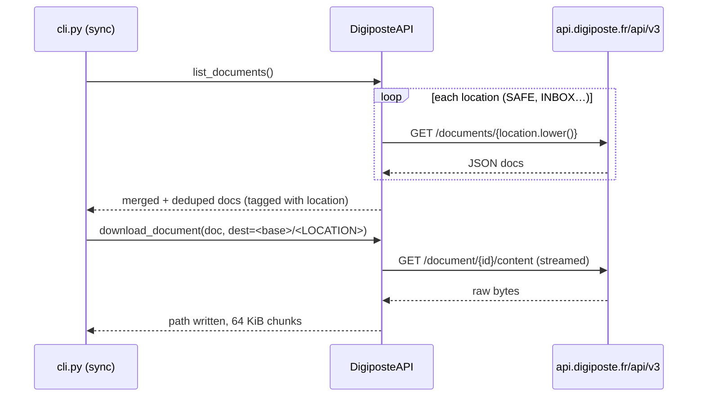

# digiposte-cli — Technical Specification

This document describes **how** `digiposte-cli` is built: architecture, module
responsibilities, data flows and the design decisions that matter when touching
the code. Read it together with:

- [docs/functional-specs.md](functional-specs.md) — the user-facing behavior;
- [docs/AUTH.md](AUTH.md) — the browser-authentication internals (read this
  before modifying `auth.py`);
- [docs/API.md](API.md) and [docs/swagger.json](swagger.json) — the underlying
  HTTP API.

## 1. Tech stack & packaging

| Item | Choice |
| --- | --- |
| Language | Python ≥ 3.11 |
| CLI | `argparse` subcommands, then validated with **pydantic v2** (`schemas.py`) |
| Config | **TOML** (`tomllib` stdlib), validated with pydantic |
| HTTP | `requests` (Bearer-authenticated API + CDP health probes) |
| Browser | `playwright` — **attach over CDP** only (never used to launch the anti-CAPTCHA Chrome) |
| Data validation | pydantic v2 (`BaseModel`, `extra="forbid"` for the config) |
| Build | `uv_build` backend; project managed with `uv`; entry point `digiposte-cli = digiposte_cli.cli:main` (`pyproject.toml`) |
| Lint/type | `ruff` (line-length 100), basedpyright standard mode |

## 2. Repository & module layout

```
src/digiposte_cli/
├── __init__.py        # empty (package marker)
├── __main__.py        # python -m digiposte_cli → cli.main()
├── cli.py             # subcommands, bootstrap, orchestration
├── config.py          # TOML loading/validation → Config dataclass
├── schemas.py         # pydantic models (TOML + CLI) — the trusted boundary
├── paths.py           # XDG path resolution
├── auth.py            # browser authentication + token cache
├── api.py             # Digiposte v3 HTTP client
└── assets/
    └── config.toml    # shipped template (importlib.resources)
```

### Module responsibilities

| Module | Responsibility |
| --- | --- |
| `cli.py` | Parses args, validates them (`CliOptions`), bootstraps config/logging/paths, runs each subcommand, maps errors to exit codes. |
| `config.py` | Resolves the config path, writes the template if missing, parses/validates the TOML (`tomllib` + `ConfigFile`), returns an effective `Config` dataclass with defaults already resolved. |
| `schemas.py` | Central validation of every external value (config sections `AuthFile`, `PlaywrightFile`, `ApiFile`, `DownloadFile`, `LogFile`, `PathsFile`, `ConfigFile`; CLI `CliOptions`). `extra="forbid"` rejects unknown keys. |
| `paths.py` | Pure XDG resolution (data/state/cache homes, `~/Documents`); no application state in the source tree. |
| `auth.py` | Token cache (load/save), the two browser login paths, cookie → API-token fetch. |
| `api.py` | `DigiposteAPI` client: per-location listing, document download, file-name naming (sanitization + `[download] rename_rules` applied to the stem, legacy-file rename). |

## 3. Configuration subsystem

**Precedence:** CLI option → TOML config file → built-in default.

```
CLI (argparse) → CliOptions (pydantic)   ──┐
                                            ├─► effective Config (config.py)
config.toml   → ConfigFile (pydantic)      ─┘        │
                                                      ▼
                              XDG defaults filled in when a [paths] key is empty
```

- `tomllib.loads` parses the file; a `TOMLDecodeError`/`OSError` raises
  `ConfigurationError` (→ exit code 2).
- The template (`assets/config.toml`) is read via
  `importlib.resources` so it ships inside the wheel; every key is commented
  out, documenting its default.
- Config-file path: `~/.config/digiposte-cli/config.toml`, overridable with
  `--config`. `_resolve_path` applies `Path.expanduser()`.
- `command:` secrets (`_resolve_secret` in `cli.py`) are executed through
  `$SHELL -c` **non-interactively** (20 s timeout); their stdout (minus the
  trailing newline) is the value. Failure → warning + empty value.
- `Config` is a plain `@dataclass` with built-in defaults; `locations` defaults
  to `["SAFE", "INBOX"]`, `max_results` to 1000 (pydantic-constrained to
  `1..100_000`); `rename_rules` defaults to `[]`.
- `[download] rename_rules` (a `list` of `{pattern, replacement}`) holds regex
  substitutions applied to downloaded file names. Each rule is validated when
  the config is read: `re.compile(pattern)` + a dry-run `re.sub` on an empty
  string (which parses the replacement template, catching bad back-references
  like `\2` on a single-group pattern) → `ConfigurationError` otherwise.

## 4. Path resolution (`paths.py`)

- `xdg_data_home()` → `$XDG_DATA_HOME` or `~/.local/share`
- `xdg_state_home()` → `$XDG_STATE_HOME` or `~/.local/state`
- `xdg_cache_home()` → `$XDG_CACHE_HOME` or `~/.cache`
- `documents_dir()` → `~/Documents`; `download_dir()` → `~/Documents/digiposte`
- `profile_dir()` → `~/.local/share/digiposte-cli/chrome-profile` *(legacy
  Playwright profile)*
- `debug_profile_dir()` → `~/.local/state/digiposte-cli/chrome-debug`
  *(dedicated Chrome `--user-data-dir`, default auth path)*
- `token_cache_path()` → `~/.local/state/digiposte-cli/token.json`

## 5. Authentication subsystem (`auth.py`)

### 5.1 Token model and cache

- `AuthInfo` = `access_token` + `expires_at` (unix seconds).
- The cache JSON (`{access_token, expires_at}`) is read by `load_token_cache`
  (returns `None` when expired/malformed; `_SAFETY_MARGIN = 60` s) and written
  by `save_token_cache`.
- **Validity policy:** the server's own `expires_at` is *not* trusted (clock
  skew makes it come back ≈ now on this machine). The CLI assigns its own
  `_TOKEN_TTL = 3600` from the moment the token is obtained, like the web SPA.

### 5.2 Authentication paths

Two paths exist; the **dedicated-Chrome/CDP path is the default**
(`use_running_chrome = True` in `Config` and `AuthFile`).



**Dedicated Chrome / CDP** (`login_via_own_chrome`):

1. Locate a Chromium binary (`_find_chrome_binary`: `google-chrome-stable`,
   `google-chrome`, `chromium`, …).
2. If a Chrome already answers on `http://127.0.0.1:9222` (`_cdp_reachable`,
   GET `/json/version`) → plain **attach** (`connect_over_cdp`), leave it
   running.
3. Else launch a **headless** dedicated Chrome as a plain subprocess
   (`_launch_chrome_debug`: `--remote-debugging-port`, `--user-data-dir`,
   `--headless=new`, **no URL on the command line**) and run a short probe: if
   the stored SSO session is alive, fetch a token with no window; the probe
   **fast-fails** as soon as the login form (`#username`) appears
   (`_login_form_visible`).
4. Wait for the probe's Chrome to release the profile/port (`_wait_cdp_gone` —
   Chrome is single-instance per `--user-data-dir`), then launch a **visible**
   window: credentials are auto-filled with a human cadence, the user solves a
   CAPTCHA if any, then the Chrome is closed (`_terminate_chrome`) — the
   session stays on disk.

Attaching (`_login_over_cdp`): navigate only via `ctx.new_page().goto()`;
`_pick_session_context` chooses the context holding a
digiposte.fr/laposte.fr cookie; token fetch shared by `_token_from_session`
(4 s SPA settle, cookies → `/rest/security/token` with `X-XSRF-TOKEN`, fallback
to the SPA `sessionStorage`).

**Legacy Playwright profile** (`use_running_chrome = false`): a persistent
profile under `profile_dir()`; `refresh_session_token` tries a silent headless
renewal first, `manual_login` shows a visible browser otherwise.

### 5.3 Anti-bot & page handling (see `docs/AUTH.md` for the full story)

- The login form is **localized** (fr-FR): stable ids `#username` / `#password`
  are targeted, never aria-labels.
- A Tarteaucitron **consent banner** can overlay the form twice; it is dismissed
  (`_dismiss_consent_banner`) and fields are only used when truly reachable
  (`_field_reachable` checks `document.elementFromPoint`).
- Autofill uses human-like typing and settle waits (an instant `fill()`+click
  is itself a bot trigger).
- Automation markers are minimized (`_ANTI_DETECTION_JS`); the anti-CAPTCHA
  Chrome is launched as a plain subprocess, **never through Playwright** — a
  Playwright-launched Chrome is detected by `liveidentity` and shows a blank,
  unsolvable CAPTCHA.

## 6. API client (`api.py`)

Targets the **personal vault internal API** `https://api.digiposte.fr/api/v3`
(Bearer token) — never the partner OKAPI API (`api.laposte.fr`), which cannot
read the account holder's own vault.



Details:

- `session.headers` always include `Authorization: Bearer`,
  `X-API-VERSION-MINOR: 2`, `Accept`/`Content-Type: application/json`.
- **Listing**: `list_documents()` GETs `/documents/{location.lower()}` for each
  configured location (config identifiers are uppercase API enums; routes use
  lowercase slugs, e.g. `/documents/safe`), merges and dedupes by document id,
  and tags every document with its canonical uppercase `location`
  (`doc.setdefault("location", location)`). `max_results` is carried on the
  client but the per-location routes have no folder filter.
- `_extract_documents` tolerates the response shapes (direct list or
  `{results|documents|items|hits|content: [...]}`).
- **File names**: `_safe_filename` sanitizes title/name/subtitle (illegal
  filename characters → `_`, whitespace collapsed) and appends the extension if
  missing. Because the names come from the vault content (not the API), the
  on-disk name is finalized by `file_name_for(doc)` = `_safe_filename(doc)`
  then `_apply_rename_rules`, which applies the configured `[download]`
  `rename_rules` (compiled `(pattern, replacement)` pairs) **in order** to the
  file *stem* (everything before the last `.` extension, so `$`-anchored
  patterns don't have to account for the extension). `legacy_file_names_for`
  returns the pre-rules name (the raw sanitized name) and `rename_legacy`
  renames an on-disk file found under that name to the current one — mirroring
  ameli-cli, so files downloaded before the rules existed are not downloaded
  twice.
- **Download**: `download_document()` streams `GET /document/{id}/content`
  (120 s timeout, 64 KiB chunks) into `<destination>/<file name>`.
- HTTP 401 → clear hint to run `digiposte-cli login`.

## 7. Orchestration (`cli.py`)

`sync` is the reference pipeline:

1. **Bootstrap** — `_bootstrap_config` (resolve/create/validate config, set up
   logging) then `_bootstrap_paths` (compute profile dirs, cache path, download
   dir, channel, headless, `use_running_chrome`).
2. **Step 1 — authentication** via `_authenticate` (see §5); abort with exit 1
   on failure.
3. **Step 2 — listing** via `api.list_documents()`.
4. **Step 3 — download**: create the base dir **and one sub-folder per
   configured location** (even empty ones, so the tree mirrors the config),
   then for each document compute `dest = <base>/<location>` (fallback `MISC`)
   and `file_name = api.file_name_for(doc)` (canonical, after the
   `[download] rename_rules`): skip it when `<dest>/<file_name>` already exists
   (filename-only skip); else try `api.rename_legacy(doc, dest)` — a file left
   under the pre-rules (un-renamed) name is renamed to the canonical one and
   counted as `renamed`; else download under the canonical name. Final report:
   downloaded vs renamed vs already present.

`list` (`ls`) prints `label\tid` per document (or the raw JSON on stdout with
`--json`). `login` is idempotent (valid cache → message, no browser). `logout`
removes the token; `--reset` also `shutil.rmtree`s both profiles.

### Logging

- Human logs go to **stderr** (`_LOG_FORMAT`, timestamped), so `stdout` stays
  usable for `ls --json`.
- The `asyncio` logger is set to `CRITICAL` to silence Playwright's Node-driver
  transport noise.
- Exit codes: `0` success · `1` auth/backup failure · `2` invalid
  config/options (`ConfigurationError`, pydantic validation) · `130` Ctrl-C.

## 8. Security considerations

- The dedicated Chrome exposes its profile on `127.0.0.1:9222` (loopback only);
  it is a **dedicated, app-owned profile**, never the user's personal one.
- Tokens are plain JSON under `~/.local/state` (readable by the local user).
- `command:` secrets run non-interactively through `$SHELL -c`; they must be
  real executables (shell functions from startup files are not loaded).
- `logout --reset` is the only path that deletes the persisted browser
  sessions.

## 9. Known limitations & gotchas (design constraints)

- **Filename-only skip**: no local content index — a renamed or updated
  document re-downloads/skips by name only.
- **Single-instance Chrome per `--user-data-dir`**: the headless probe must
  fully release the profile/port before the visible window can start.
- **Server `expires_at` skew**: the cache TTL is self-assigned (1 h), not taken
  from the server response.
- **`--headless` cannot log in**: a CAPTCHA is unsolvable headless; headless is
  only for silent session reuse.
- **Old flat layout**: documents downloaded before the per-location layout stay
  flat; the next `sync` re-downloads them under their location folder (no
  auto-migration).
